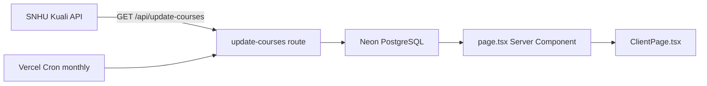

# SNHU Transfer Equivalency List

An unofficial, searchable index of Southern New Hampshire University (SNHU) transfer credit equivalencies. Browse accepted courses from AP Exams, Sophia Learning, Study.com, and other providers — grouped and filterable in one place.

> **Disclaimer:** This project is not affiliated with SNHU. It is an unofficial compilation of publicly available transfer data. Always verify eligibility on the [official SNHU website](https://www.snhu.edu/admission/transferring-credits) and with your academic advisor before making transfer decisions.

## Features

- Search by course code, title, or organization
- Group results by **Subject**, **Organization**, or **Academic Level**
- Expandable rows showing eligibility timeframe and links to official SNHU experience pages
- Monthly automated data refresh via Vercel Cron

## How it works



1. Course mappings are parsed from experience achievement criteria and written to a Neon PostgreSQL database via Drizzle ORM.
2. The home page server component loads grouped course data from the database.
3. A client component handles search, view tabs, and expandable row details.
4. After each successful sync, the page cache is revalidated via `revalidatePath('/')`.

## Tech stack

| Layer | Choice |
|-------|--------|
| Framework | Next.js 16 (App Router), React 19 |
| Styling | Tailwind CSS 4 |
| Database | Neon PostgreSQL via `@neondatabase/serverless` |
| ORM | Drizzle ORM |
| Hosting | Vercel (Analytics + Cron) |
| Testing | Jest + React Testing Library |

Requires Node.js **24.x**.

## Prerequisites

- Node.js 24.x
- A Neon (or compatible) PostgreSQL database
- A `POSTGRES_URL` connection string

## Environment variables

Copy `.env.example` to `.env` and fill in your values:

| Variable | Required | Description |
|----------|----------|-------------|
| `POSTGRES_URL` | Yes | Neon/Postgres connection string |
| `CRON_SECRET` | Recommended in production | Bearer token protecting `/api/update-courses`; Vercel Cron sends this automatically |

```bash
POSTGRES_URL=postgresql://...
CRON_SECRET=your-random-secret
```

## Local development

1. Install dependencies:

   ```bash
   npm install
   ```

2. Create `.env` with the variables above.

3. Initialize the database table:

   ```bash
   npx tsx scripts/setup-db.ts
   ```

4. Populate course data from the Kuali API:

   ```bash
   npx tsx scripts/populate.ts
   ```

5. Start the dev server:

   ```bash
   npm run dev
   ```

6. Open [http://localhost:3000](http://localhost:3000).

## Available scripts

| Command | Purpose |
|---------|---------|
| `npm run dev` | Start Next.js dev server |
| `npm run build` | Production build |
| `npm run start` | Run production server |
| `npm run lint` | ESLint |
| `npm test` | Jest tests |
| `npx tsx scripts/setup-db.ts` | Drop/recreate `transfer_courses` table |
| `npx tsx scripts/populate.ts` | Fetch from Kuali API and write to DB |

## API and scheduled updates

- **Endpoint:** `GET /api/update-courses`
- **Auth:** `Authorization: Bearer $CRON_SECRET` (skipped locally if `CRON_SECRET` is unset)
- **Schedule:** Monthly on the 1st at midnight UTC (`0 0 1 * *` in `vercel.json`)
- **Behavior:** Fetches all experiences, parses course mappings from HTML criteria, replaces all rows in `transfer_courses`, and revalidates `/`

## Project structure

```
src/
  app/
    page.tsx                      # Server component — loads courses from DB
    ClientPage.tsx                # Client UI — search, grouping, expand rows
    api/update-courses/route.ts   # Data sync endpoint
  db/
    schema.ts                     # Drizzle transfer_courses table definition
    index.ts                      # Neon + Drizzle client
scripts/
  setup-db.ts                     # transfer_courses table creation
  populate.ts                     # Run sync locally
```

## Testing

```bash
npm test
```

Tests in `src/app/page.test.tsx` mock the database and cover page rendering, row expansion, and search filtering.

## Deployment (Vercel)

1. Connect the repository to Vercel.
2. Set `POSTGRES_URL` and `CRON_SECRET` in the project environment variables.
3. Deploy — the cron schedule in `vercel.json` is applied automatically.
4. Vercel attaches the cron secret to scheduled requests to `/api/update-courses`.
